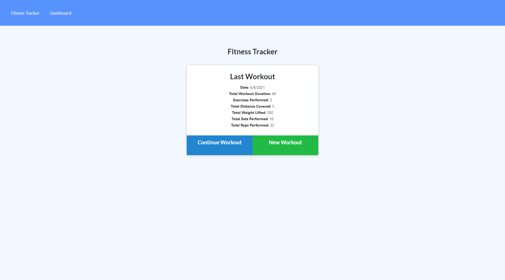

# Unit 18 Nosql Homework: Workout Tracker

## User Story

* As a user, I want to be able to view create and track daily workouts. I want to be able to log multiple exercises in a workout on a given day. I should also be able to track the name, type, weight, sets, reps, and duration of exercise. If the exercise is a cardio exercise, I should be able to track my distance traveled.

## Installation

if git cloning use ```npm i```, ```npm run seed``` then use ```npm start```. 

## Preview

